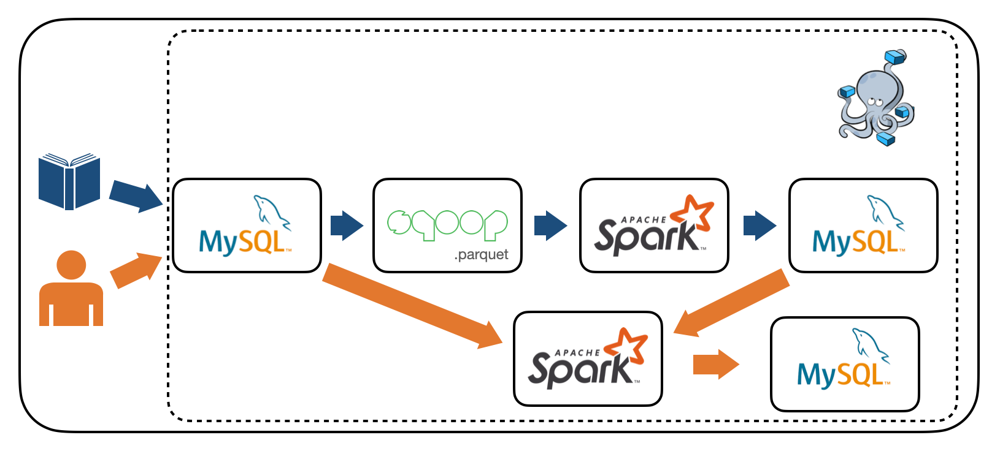

# Book data pipeline Project
매주 인기있는 도서 중 사용자가 선호하는 책과 비슷한 책을 추천해주는 서비스를 위한 파이프라인입니다.


# Architecture
 

네이버 책에서 카테고리별 top100 책 정보를 일주일에 한 번 스크래핑하여 <kbd>Mysql</kbd> DB에 저장합니다. 스크래핑이 완료되어 <kbd>Mysql</kbd> DB에 저장이 완료된 책 데이터는 <kbd>Sqoop</kbd>에서 수집된 날짜 디렉토리(local fs)에 parquet 형식으로 저장됩니다. 파케이 파일들을 <kbd>Spark</kbd>에서 전처리하고 Word2Vec 모댈을 적용해 줄거리 단어들을 벡터화합니다. 벡터화된 줄거리 정보도 추가하여 <kbd>mysql</kbd>에 적재합니다. 

사용자가 선호하는 책 정보가 업데이트되면 책 추천 알고리즘을 적용합니다. 선호하는 책을 네이버 책 API를 통해 줄거리 정보를 가져오고, <kbd>Spark</kbd>에서 해당 문서를 Word2Vec 모델링을 통해 벡터화합니다. <kbd>MongoDB</kbd>에 있는 책 데이터들 중 벡터화된 줄거리와 코사인 유사도가 가장 높은 다섯개의 책을 추천 결과로 반환합니다.


# ETL process


# How to use
```bash
cd {download_directory}/BookDataPipeline

docker-compose pull
docker-compose up -d
docker-compose ps
```

컨테이너들이 다 정상적으로 기동되면 파이프라인을 위한 환경구성이 완료됩니다.


- 에어플로우 기동
    - 스크래핑 코드 작동
    - 데이터 다 mysql에 스크래핑 되면 sqoop 통해서 local fs에 파케이로 저장
    - spark에서 줄거리 전처리, 벡터화 -> mongodb에 저장

- mysql에 user 테이블에 데이터 수동으로 추가
    - 에어플로우 trigger


```bash

```

